* ## 약수(No.1037)
 
       
       

    ```Java
    import java.util.*;
    import java.io.*;

    public class Main {
        public static void main(String[] args) throws IOException {
            BufferedReader br = new BufferedReader(new InputStreamReader(System.in));
            int count = Integer.parseInt(br.readLine());

            int max = Integer.MAX_VALUE;
            int min = Integer.MIN_VALUE;

            StringTokenizer st = new StringTokenizer(br.readLine(), " ");

            while (count-- > 0) {
                max = N < max ? N : max;
                min = N > min ? N : min;
            }

            System.out.println(max * min);
        }
    }
    ```
---


* ## 최대공약수와 최소공배수(No.2609)
 
       
      

    ```Java
    import java.util.*;
    import java.io.*;

    public class Main {
        public static void main(String[] arsg) throws IOException {
            BufferedReader br = new BufferedReader(new InputStreamReader(System.in));
            StringTokenizer st = new StringTokenizer(br.readLine(), " ");
            int x = Integer.parseInt(st.nextToken());
            int y = Integer.parseInt(st.nextToken());

            StringBuilder sb = new StringBuilder();
            sb.append(getGCD(x, y));
            sb.append("\n");
            sb.append(getLCM(x, y));

            System.out.println(sb);
        }

        static int getGCD(int x, int y) {
            if (x % y == 0) {
                return y;
            } else {
                return getGCD(y, x % y);
            }
        }

        static int getLCM(int x, int y) {
            return (x * y) / getGCD(x, y);
        }
    }
    ```

---

* ## 일곱 난쟁이(No.2309)

       
      

<br>

* 첫 번째 풀이

    ```Java
    import java.io.*;
    import java.util.*;

    /*
    * 9명중 7명 추려내기
    * 7명의 난쟁이 키의 합 == 100
    * 9명의 남채잉 키가 주어진다
    * ---------------------
    * 7명의 난쟁이 키를 오름차순 정렬
    * 9명의 총합에서 100을 빼서 초과하는 키 추출
    * 9개의 요소중 2개를 선별했을때 초과하는 키가 되는 경우를 찾는다
    * 위의 경우를 배열에서 제외시킨다
    * */
    public class No_17427 {
        public static void main(String[] args) throws IOException {

            BufferedReader br = new BufferedReader(new InputStreamReader(System.in));
            ArrayList<Integer> arr = new ArrayList<>();
            int total = 0;

            for (int i = 0; i < 9; i++) {
                arr.add(Integer.parseInt(br.readLine()));
                total += arr.get(i);
            }

            int rest = total - 100;

            for (int i = 0; i < arr.size() - 1; i++) {
                for (int j = 1; j < arr.size(); j++) {
                    if (arr.get(i) + arr.get(j) == rest) {
                        arr.remove(i);
                        arr.remove(j);
                    } else {
                        continue;
                    }
                }
            }

            Collections.sort(arr);

            for (Integer integer : arr) {
                System.out.println(integer);
            }
        }
    }

    ```
    >ArrayList.remove()에서 원하는 요소가 제거되지 않는 문제 발생

<br>

* 정답을 참고한 풀이
  
    ```Java
    import java.io.*;
    import java.util.*;

    public class Main {
        public static void main(String[] args) throws IOException {

            BufferedReader br = new BufferedReader(new InputStreamReader
            (System.in));
            StringBuilder sb = new StringBuilder();
            
            int[] arr = new int[9];
            int total = 0;
            int spyA = 0;
            int spyB = 0;

            for (int i = 0; i < arr.length; i++) {
                arr[i] = Integer.parseInt(br.readLine());
                total += arr[i];
            }

            for (int i = 0; i < arr.length; i++) {
                for (int j = 1; j < arr.length - 1; j++) {
                    if (arr[i] + arr[j] == total - 100) {
                        spyA = arr[i];
                        spyB = arr[j];
                    }
                }
            }

            Arrays.sort(arr);

            for (int i : arr) {
                if (i == spyA || i == spyB) {
                    continue;
                } else {
                    sb.append(i);
                    sb.append("\n");
                }
            }

            System.out.println(sb);
        }
    }
    ```

---

* ## 날짜 계산(No.1476)

    <br>

       
      

    <br>

    ```Java
    import java.io.*;
    import java.util.*;
    
    public class Main {
        public static void main(String[] args) throws IOExcpetion {

            BufferedReader br = new BufferedReader(new InputStreamReader(System.in));
            StringTokenizer st = new StringTokenizer(br.readLine(), " ");

            int E = Integer.parseInt(st.nextToken());
            int S = Integer.parseInt(st.nextToken());
            int M = Integer.parseInt(st.nextToken());

            int year = 0;
            int e = 0;
            int s = 0;
            int m = 0;

            while (true) {
                year++;
                e++;
                s++;
                m++;

                e = e == 16 ? 1 : e;
                s = s == 29 ? 1 : s;
                m = m == 20 ? 1 : m;

                if (e == E && s == S && m == M) break;
            }

            System.out.println(year);
        }
    }
    ```

---

* ## N과 M(1)

```Java
import java.io.*;
import java.util.*;

public class Main {

    public static int[] arr;
    public static boolean[] visit;
    public static StringBuilder sb = new StringBuilder();

    public static void main(String[] args) throws IOException {

        BufferedReader br = new BufferedReader(new InputStreamReader(System.in));
        StringTokenizer st = new StringTokenizer(br.readLine());

        int N = Integer.parseInt(st.nextToken());
        int M = Integer.parseInt(st.nextToken());

        arr = new int[M];
        visit = new boolean[N];

        DFS(M, N, 0);
        System.out.println(sb);
    }

    public static void DFS(int M, int N, int depth) {
        if (depth == M) {
            for (int i : arr) {
                sb.append(i).append(' ');
            }
            sb.append('\n');
            return;
        }

        for (int i = 0; i < N; i++) {
            if (!visit[i]) {
                visit[i] = true;
                arr[depth] = i + 1;
                DFS(M, N, depth + 1);
                visit[i] = false;
            }
        }
    }
}
```

---

<br>

## N과 M(2)

<br>

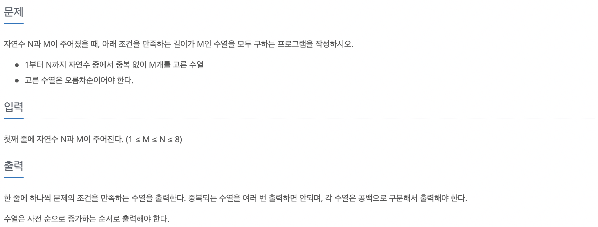

<br>

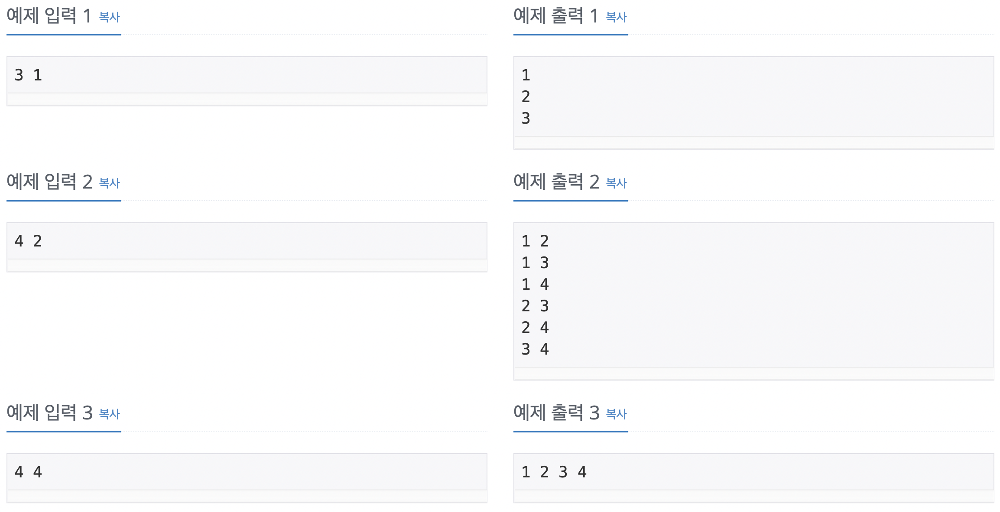

<br>

```Java
/*
--- 출력 예시 ---             --- 알고리즘 ---
* 1 1 (x)                   * 시작점을 갖는 변수를 지정한다
* 1 2
* 1 3
* 1 4
* 2 1 (x)
* 2 2 (x)
* 2 3
* 2 4
* 3 1 (x)
* 3 2 (x)
* 3 3 (x)
* 3 4
* 4 1 (x)
* 4 2 (x)
* 4 3 (x)
* 4 4 (x)
*/

import java.io.*;
import java.util.*;

public class Main {

    public static int N;
    public static int M;
    public static int[] arr;
    public static StringBuilder sb = new StringBuilder();

    public static void main(String[] args) throws IOException {

        BufferedReader br = new BufferedReader(new InputStreamReader(System.in));
        StringTokenizer st = new StringTokenizer(br.readLine());

        N = Integer.parseInt(st.nextToken());
        M = Integer.parseInt(st.nextToken());
        arr = new int[M];

        DFS(1, 0);

        System.out.println(sb);
    }

    public static void DFS(int at, int depth) {

        if (depth == M) {
            for (int i : arr) {
                sb.appedn(i).append(' ');
            }
            sb.append('\n');

            return;
        }

        for (int i = at; i <= N; i++) {
            arr[depth] = i;
            DFS(i + 1, depth + 1;)
        }
    }
}
```

---

<br>

## N과 M(3)

<br>

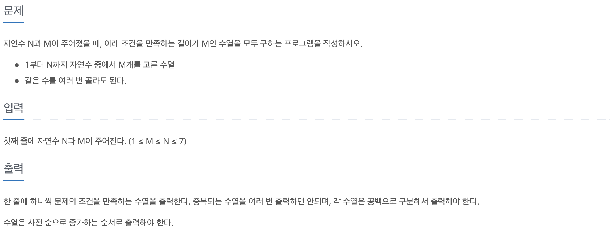

<br>

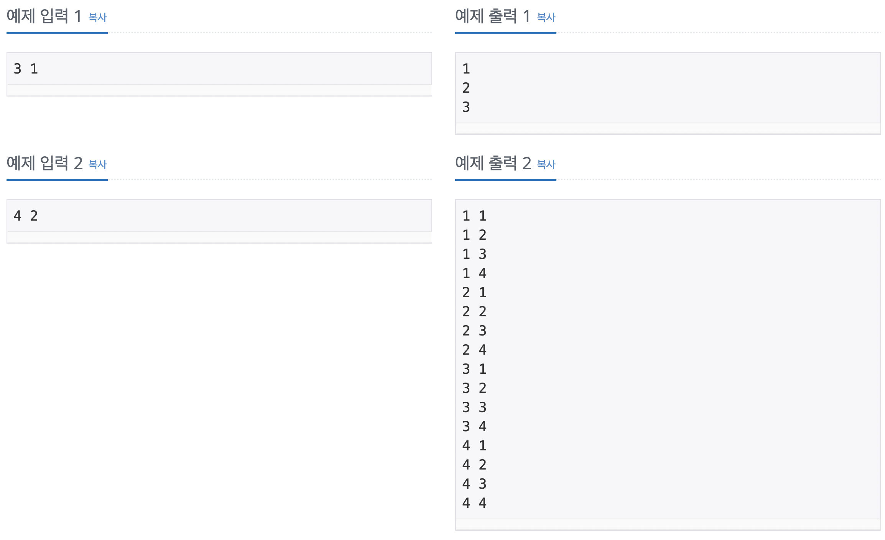

<br>

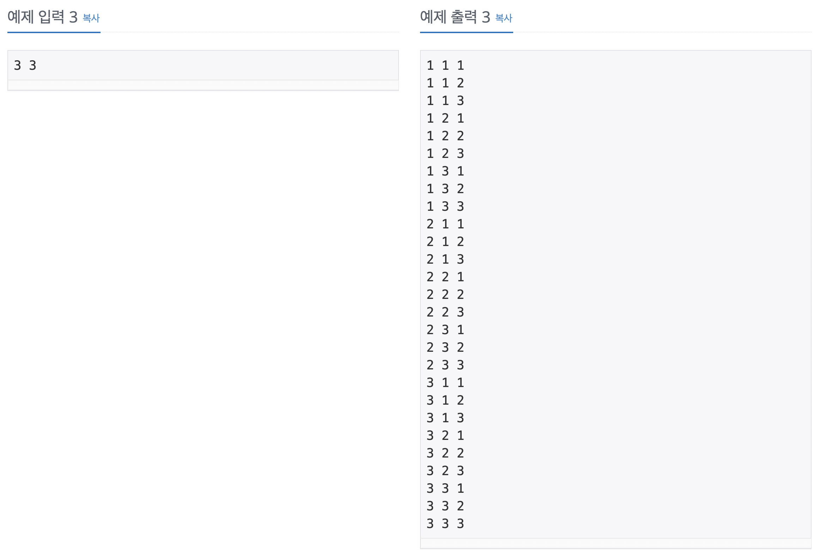

<br>

```Java
/*
* --- 알고리즘 ---
* 같은 수의 중복을 허용하므로 N과 M(1)에서 노드의 유효성(visit)을 제외하면 될것이라 생각
*/

import java.io.*;
import java.util.*;

public class Main {

    public static int[] arr;
    public static StringBuilder sb = new StringBuilser();

    public static void main(String[] args) throws IOException {

        BufferedReader br = new BufferedReader(new InputStreamReader(System.in));
        StringTokenizer st = new StringTokenizer(br.readLine());

        int N = Integer.parseInt(st.nextToken());
        int M = Integer.parseInt(st.nextToken());
        arr = new int[M];

        DFS(M, N, 0);

        System.out.println(sb);
    }

    public static void DFS(int M, int N, int depth) {

        if (depth == M) {
            for (int i : arr) {
                sb.append(i).append(' ');
            }
            sb.append('\n');
            
            return;
        }

        for (int i = 0; i < N; i++) {
            arr[depth] = i + 1;
            DFS(M, N, depth + 1);
        }
    }
}
```

---

<br>

## N과 M(4)_No.15652

<br>

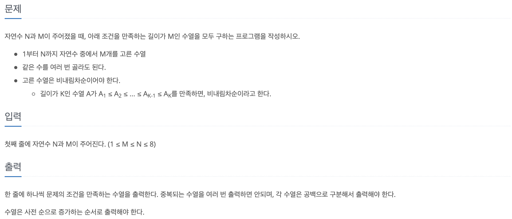

<br>

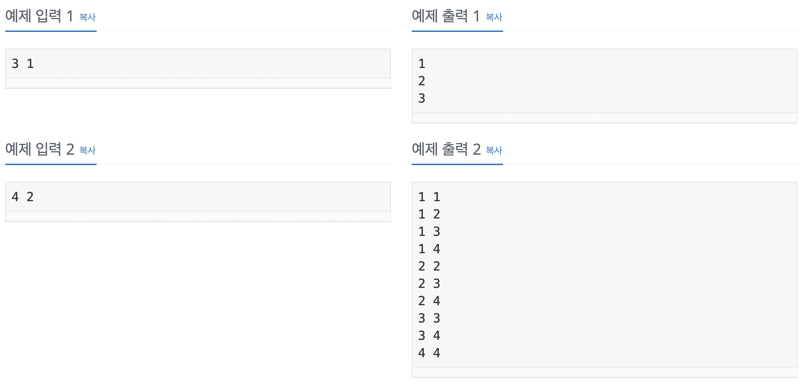

<br>

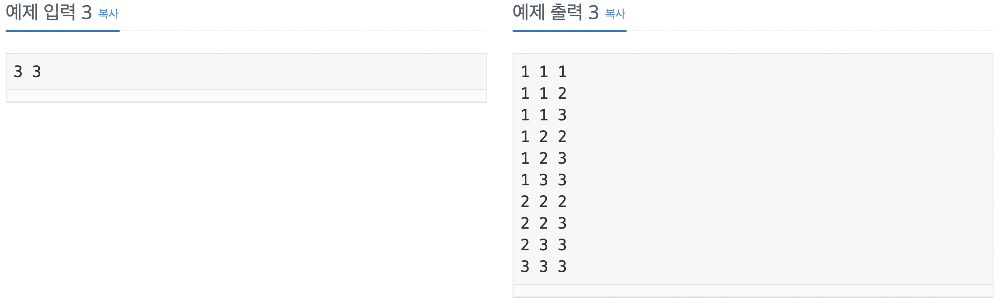

<br>

```Java
import java.io.*;
import java.util.*;

public class Main {

    public static int N;
    public static int M;
    public static int[] arr;
    public static StringBuilder sb = new StringBuilder();

    public static void main(String[] args) throws IOException {

        BufferedReader br = new BufferedReader(new InputStreamReader(System.in));
        StringTokenizer st = new StringTokenizer(br.readLine());

        N = Integer.parseInt(st.nextToken());
        M = Integer.parseInt(st.nextToken());
        arr = new int[M];

        DFS(1, 0);

        System.out.println(sb);
    }

    public static void DFS(int at, int depth) {

        if (depth == M) {
            for (int i : arr) {
                sb.append(i).append(' ');
            }
            sb.append('\n');

            return;
        }

        for (int i = at; i <= N; i++) {
            arr[depth] = i;
            DFS(i, depth + 1);
        }
    }
}
```

---

<br>

## N과 M(5)_No.15654

<br>

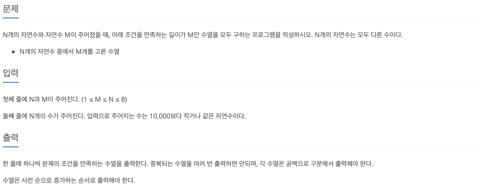

<br>

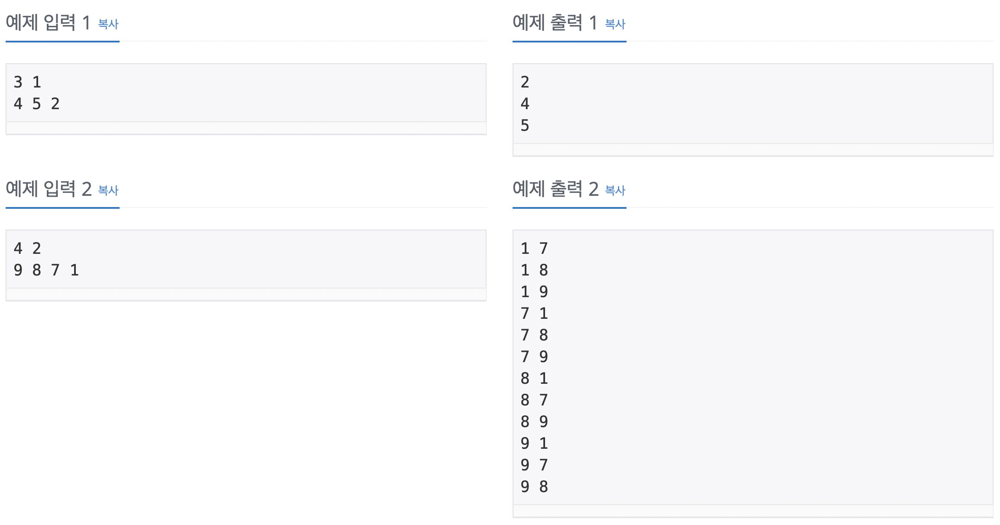

<br>

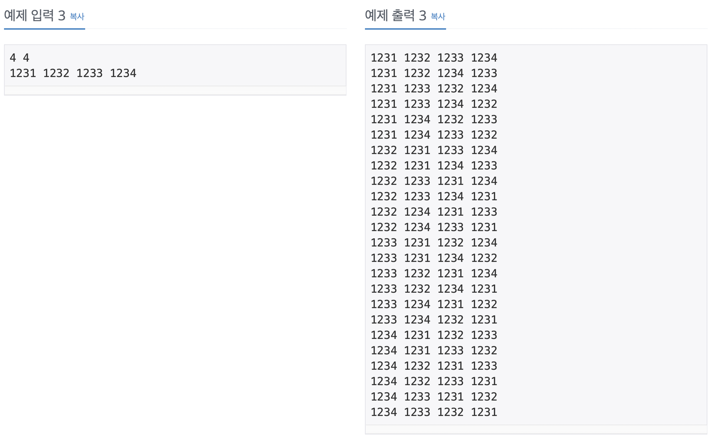

<br>

```Java
import java.io.*;
import java.util.*;

public class Main {

    public static int M;
    public static int N;
    public static int[] arr;
    public static int[] numbers;
    public static boolean[] visit;
    public static StringBuilder sb = new StringBuilder();

    public static void main(String[] args) throws IOException {

        BufferedReader br = new BufferedReader(new InputStreamReader(System.in));
        StringTokenizer st = new StringTokenizer(br.readLien());

        N = Integer.parseInt(st.nextToken());
        M = Integer.parseInt(st.nextToken());

        arr = new int[M];
        numbers = new int[N];
        visit = new boolean[N];

        st = new StringTokenizer(br.readLine());

        for (int i = 0; i < numbers.length; i++) {
            numbers[i] = Integer.parseInt(st.nextToken());
        } 

        Arrays.sort(numbers);
        DFS(0);

        System.out.println(sb);
    }

    public static void DFS(int depth) {
        if (depth == M) {
            for (int i : arr) {
                sb.append(i).append(' ');
            }
            sb.append('\n');
            return;
        }

        for (int i = 0; i < N; i++) {
            if (!visit[i]) {
                visit[i] = true;
                arr[depth] = numbers[i];
                DFS(depth + 1);
                visit[i] = false;
            }
        }
    }
}
```

---

<br>

## N과 M(6)_No.15655

<br>


<br>

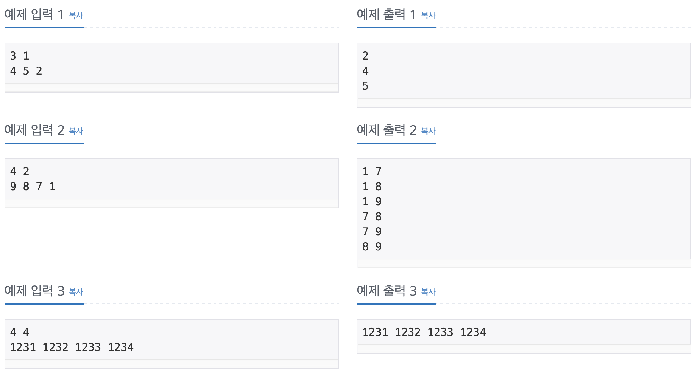

<br>

```Java
import java.util.*;
import java.io.*;

public class Main {

    public static int N;
    public static int M;
    public static int[] arr;
    public static int[] numbers;
    public static StringBuilder sb = new StringBuilder();

    public static void main(String[] args) throws IOException {

        BufferedReader br = new BufferedReader(new InputStreamReader(System.in));
        StringTokenizer st = new StringTokenizer(br.readLine());

        N = Integer.parseInt(st.nextToken());
        M = Integer.parseInt(st.nextToken());
        arr = new int[M];
        numbers = new int[N];

        st = new StringTokenizer(br.readLine());
        
        for (int i = 0; i < numbers.length; i++) {
            numbers[i] = Integer.parseIne(st.nextToken());
        }

        Arrays.sort(numbers);
        DFS(0, 0);

        System.out.println(sb);
    }

    public static void DFS(int at, int depth) {
        if (depth == M) {
            for (int i : arr) {
                sb.append(i).append(' ');
            }
            sb.append('\n');
            return;
        }

        for (int i = at; i < N; i++) {
            arr[depth] = numbers[i];
            DFS(i + 1; depth + 1);
        }
    }
}
```

