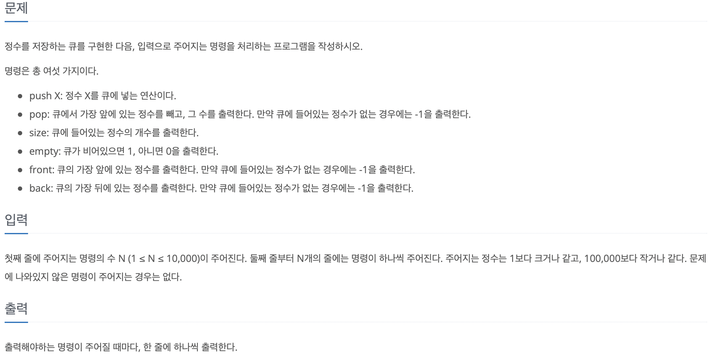
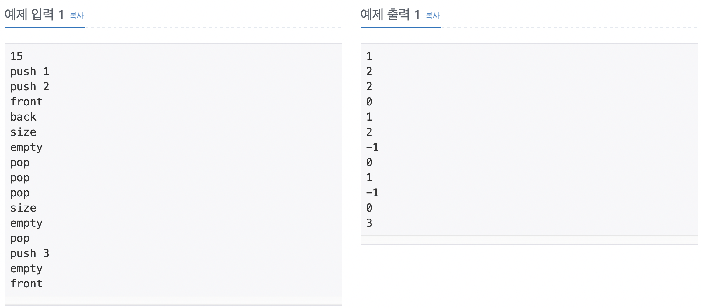
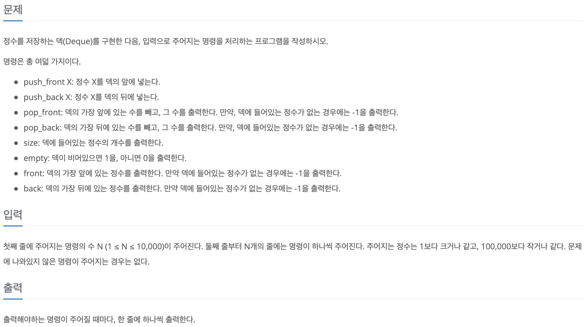
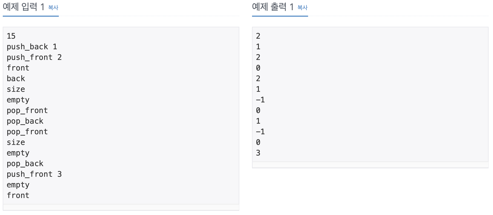
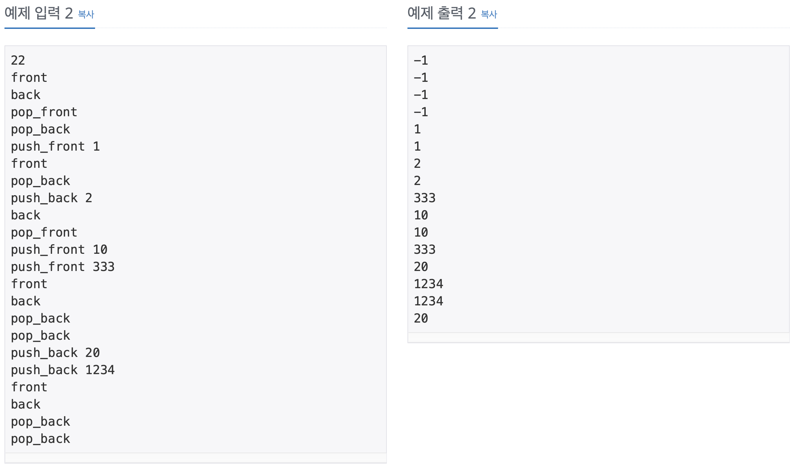
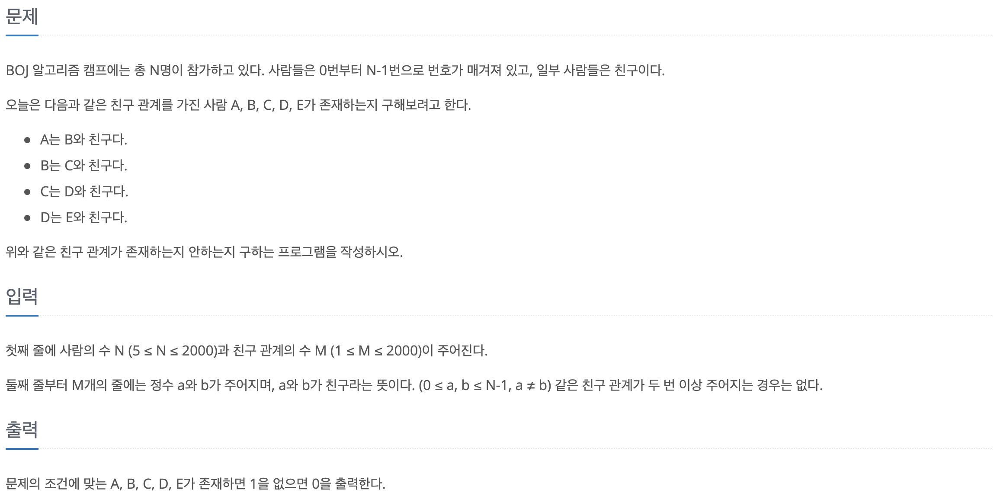
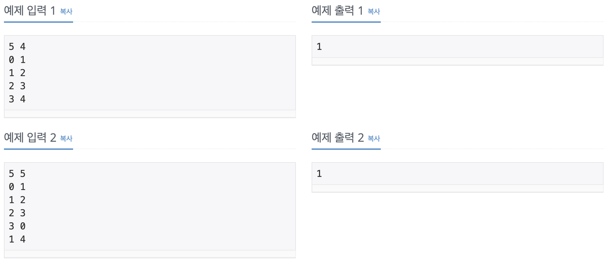
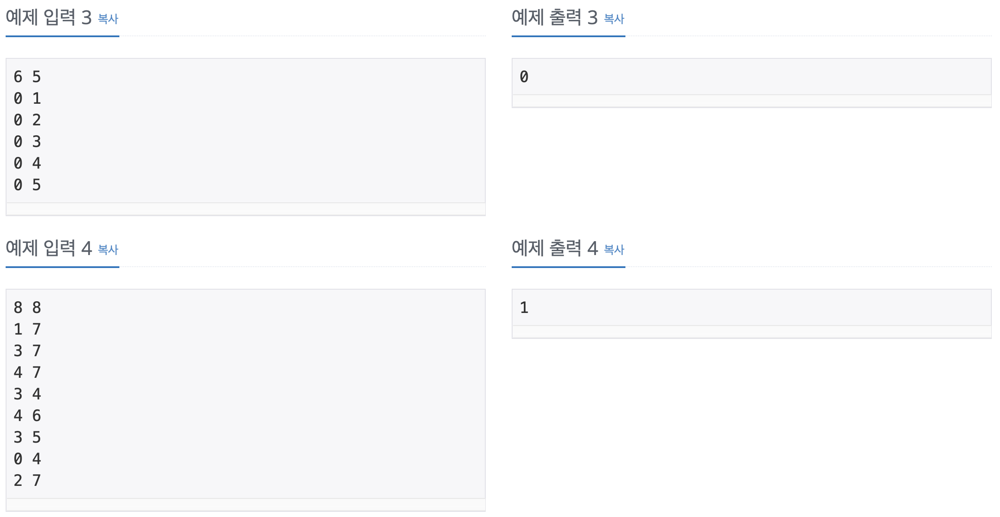
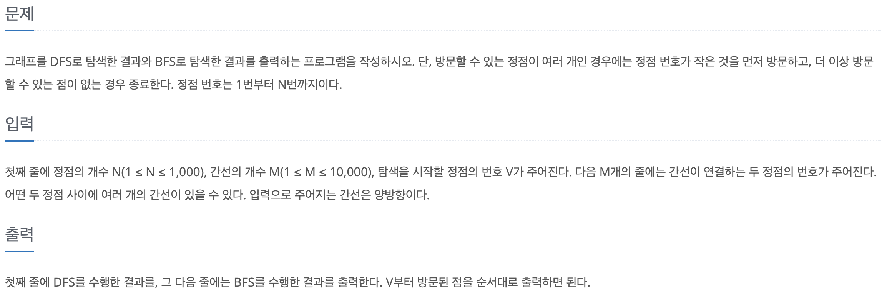

## 큐(No.10845)

<br>



<br>



<br>

Collections.Queue를 이용한 풀이   

<br>

```Java
import java.util.*;
import java.io.*;

public class Main {

    public static void main(String[] args) throws IOException {

        Queue<Integer> queue = new LinkedList<>();
        StringBuilder sb = new StringBuilder();

        BufferedReader br = new BufferedReader(new InputStreamReader(System.in));
        int N = Integer.parseInt(br.readLine());
        int last = 0;

        while (N-- > 0) {
            StringTokenizer st = new StringTokenizer(br.readLine());
            String operator = st.nextToken();

            switch (operator) {
                case "push":
                    last = Integer.parseInt(st.nextToken());
                    queue.offer(last);
                    break;

                case "pop":
                    if (queue.isEmpty()) sb.append(-1).append('\n');
                    else sb.append(queue.poll()).append('\n');
                    break;

                case "size":
                    sb.append(queue.size()).append('\n');
                    break;

                case "empty":
                    if (queue.isEmpty()) sb.append(1).append('\n');
                    else sb.append(0).append('\n');
                    break;

                case "front":
                    if (queue.isEmpty()) sb.append(-1).append('\n');
                    else sb.append(queue.peek()).append('\n');
                    break;

                case "back":
                    if (queue.isEmpty()) sb.append(-1).append('\n');
                    else sb.append(last).append('\n');
                    break;
            }
        }

        System.out.println(sb);
    }
}
```

## 덱(No.10866)

<br>



<br>



<br>



<br>

```Java
import java.util.*;
import java.io.*;

public class Main {

    public static void main(String[] args) throws IOException {

        Deque<Integer> deque = new LinkedList<>();
        StringBuilder sb = new StringBuilder();
        BufferedReader br = new BufferedReader(new InputStreamReader(System.in));

        int N = Integer.parseInt(br.readLine());
        int element;

        while (N-- > 0) {
            StringTokenizer st = new StringTokenizer(br.readLine());
            String operator = st.nextToken();

            switch (operator) {
                case "push_front":
                    element = Integer.parseInt(st.nextToken());
                    deque.offerFirst(element);
                    break;

                case "push_back":
                    element = Integer.parseInt(st.nextToken());
                    deque.offerLast(element);
                    break;

                case "pop_front":
                    if (deque.isEmpty()) sb.append(-1).append('\n');
                    else {
                        sb.append(deque.peekFirst()).append('\n');
                        deque.pollFirst();
                    }
                    break;

                case "pop_back":
                    if (deque.isEmpty()) sb.append(-1).append('\n');
                    else {
                        sb.append(deque.peekLast()).append('\n');
                        deque.pollLast();
                    }
                    break;

                case "size":
                    sb.append(deque.size()).append('\n');
                    break;

                case "empty":
                    if (deque.isEmpty()) sb.append(1).append('\n');
                    else sb.append(0).append('\n');
                    break;

                case "front":
                    if (deque.isEmpty()) sb.append(-1).append('\n');
                    else sb.append(deque.peekFirst()).append('\n');
                    break;

                case "back":
                    if (deque.isEmpty()) sb.append(-1).append('\n');
                    else sb.append(deque.peekLast()).append('\n');
                    break;
            }
        }

        System.out.println(sb);
    }
}
```

## ABCDE(No.13023)

<br>



<br>



<br>



<br>

```Java
import java.util.*;
import java.io.*;

public class Main {

    static List<Integer>[] graph;
    static boolean[] visited;
    static int answer = 0;

    public static void main(String[] args) throws IOException {

        BufferedReader br = new BufferedReader(new InputStreamReader(System.in));
        StringTokenizer st = new StringTokenizer(br.readLine());

        int vertex = Integer.parseInt(st.nextToken());
        int edge = Integer.parseInt(st.nextToken());

        graph = new ArrayList[vertex];
        visited = new boolean[vertex];

        for (int i = 0; i < vertex; i++) {
            graph[i] = new ArrayList<>();
        }

        while (edge-- > 0) {
            st = new StringTokenizer(br.readLine());

            int a = Integer.parseInt(st.nextToken());
            int b = Integer.parseInt(st.nextToken());

            graph[a].add(b);
            graph[b].add(a);
        }

        for (int i = 0; i < graph.length; i++) {
            if (answer == 0) {
                DFS(i, 0);
            }
        }

        System.out.println(answer);
    }

    static void DFS(int startVertex, int depth) {
        if (depth == 4) {
            answer = 1;
            return;
        }

        visited[startVertex] = true;

        for (int i : graph[startVertex]) {
            int nextVertex = i;

            if (!visited[nextVertex]) {
                DFS(nextVertex, depth + 1);
            }
        }

        visited[startVertex] = false;
    }
}
```

<br>

## DFS와 BFS(No.1260)

<br>



<br>


<br>

```Java
import java.io.*;
import java.util.*;

public class Main {

    static int vertex;
    static int edge;
    static int startVertex;
    static List<Integer>[] graph;
    static boolean[] visited;
    static StringBuilder sb = new StringBuilder();

    public static void main(String[] args) throws IOException {

        BufferedReader br = new BufferedReader(new InputStreamReader(System.in));
        StringTokenizer st = new StringTokenizer(br.readLine());

        vertex = Integer.parseInt(st.nextToken());
        edge = Integer.parseInt(st.nextToken());
        startVertex = Integer.parseInt(st.nextToken());

        graph = new ArrayList[vertex + 1];
        visited = new boolean[vertex + 1];

        for (int i = 0; i < graph.length; i++) {
            graph[i] = new ArrayList<>();
        }

        while (edge-- > 0) {
            st = new StringTokenizer(br.readLine());

            int a = Integer.parseInt(st.nextToken());
            int b = Integer.parseInt(st.nextToken());

            graph[a].add(b);
            graph[b].add(a);
        }

        for (int i = 0; i < graph.length; i++) {
            Collections.sort(graph[i]);
        }

        DFS(startVertex);
        sb.append('\n');

        visited = new boolean[vertex + 1];
        BFS(startVertex);

        System.out.println(sb);
    }

    static void DFS(int startVertex) {

        visited[startVertex] = true;
        sb.append(startVertex).append(' ');

        for (int i : graph[startVertex]) {
            if (!visited[i]) {
                DFS(i);
            }
        }
    }

    static void BFS(int startVertex) {

        visited[startVertex] = true;
        Queue<Integer> queue = new LinkedList<>();
        queue.add(startVertex);

        while (!queue.isEmpty()) {
            int nextVertex = queue.poll();
            sb.append(nextVertex).append(' ');

            for (int i : graph[nextVertex]) {
                if (!visited[i]) {
                    queue.add(i);
                    visited[i] = true;
                }
            }
        }

    }
}
```