## 1, 2, 3 더하기(No.9095)

<br>

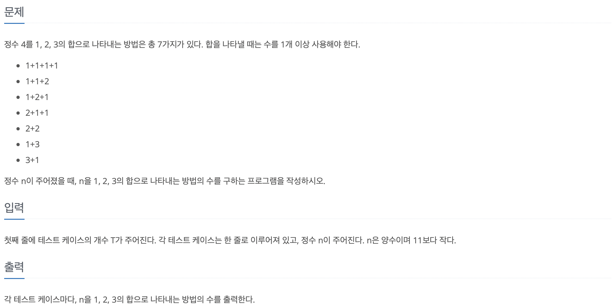

<br>

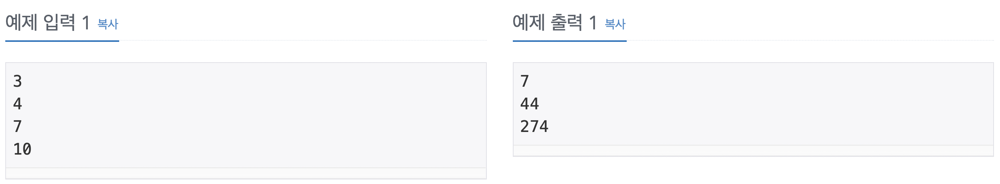

<br>

하나의 자연수를 1, 2, 3 으로만 조합하여 더해서 해당 자영수가 나오는 경우의 수를 구하는 문제이다.   

그렇다면 먼저 1, 2, 3의 경우의 수를 찾아 봐야 한다.  

d[0] = 0   
d[1] = 1밖에 없으니 경우의 수는 1   
d[2] = (1 + 1), (2) 즉, 경우의 수는 2   
d[3] = (1 + 1 + 1), (1 + 2), (2 + 1), (3) 즉 경우의 수는 3     

이렇게 되어 있을 때 d[4] = (1 + 1 + 1 + 1), (1 + 1 + 2), (1 + 2 + 1), (2 + 1 + 1), (2 + 2), (1 + 3), (3 + 1) 으로 7개가 된다.   

이것을 DP를 풀어야 한다.   

`DP의 가장 큰 특징은 문제를 작은 문제로 쪼갤 수 있어야 한다.`

그리고 작은 문제보다 더 작은 문제로부터 탑을 알고있어야 한다.   

말로 풀면 굉장히 어렵지만, 지금 알고 있는 경우의 수는 0과 1, 2, 그리고 3뿐이다. 이를 이용해서 문제를 쭉 풀어야 한다.   

d[4]를 생각할 떄   

    1. 4는 1 + 3 이다. 3을 1, 2, 3 더하기로 하였을 때의 경우의 수는 4가지 이다.      
    2. 4는 2 + 2 이다. 2를 1, 2, 3 더하기로 하였을 때의 경우의 수는 2가지 이다.   
    3. 4는 3 + 1 이다. 3을 1, 2, 3 더하기로 하였을 때의 경우의 수는 1가지 이다.   

즉, 4 + 2 + 1을 하면 7가지가 된다.   

이렇게 d[5]를 마저 생각하게 되면   
    
    1. 5는 1 + 4 이다. 4를 1, 2, 3 더하기로 하였을 때의 경우의 수는 7가지 이다.   
    2. 5는 2 + 3 이다. 3을 1, 2, 3 더하기로 하였을 때의 경우의 수는 4가지 이다.   
    3. 5는 3 + 2 이다. 2를 1, 2, 3 더하기로 하였을 때의 경우의 수는 2가지 이다.

즉, 7 + 4 + 2 를 하면 d[5]는 13개가 된다.   

이렇게 작은 문제로부터 구해진 문제를 자료구조에 저장을 해야하는데 이것을 `Memorization`라고 부른다.   

<br>


```Java
import java.util.*;
import java.io.*;

public class Main {

    public static void main(String[] args) throws IOException {

        BufferedReader br = new BufferedReader(new InputStreamReader(System.in));
        int T = Integer.parseInt(br.readLine());
        int[] arr = new int[11];

        arr[0] = 0;
        arr[1] = 1;
        arr[2] = 2;
        arr[3] = 4;

        int n = 0;

        for (int i = 0; i < T; i++) {
            n = Integer.parseInt(br.readLine());

            for (int j = 4; j <= n; j++) {
                arr[j] = arr[j - 1] + arr[j - 2] + arr[j - 3];
            }
            sb.append(arr[n]).append('\n');
        }

        System.out.println(sb);
    }
}
```

---

<br>

## 암호 만들기(No.1759)

<br>

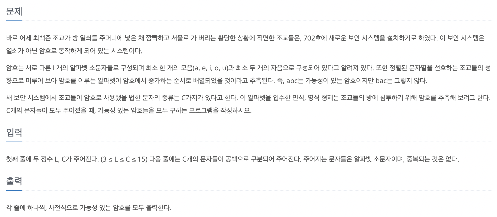

<br>

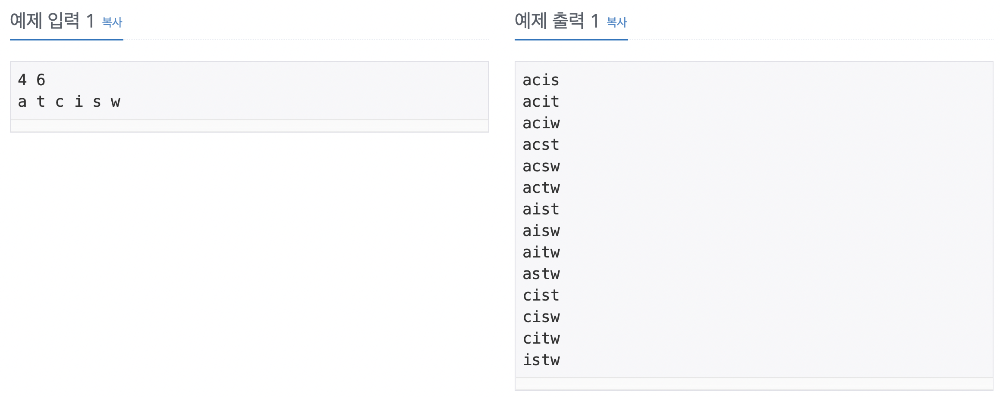

<br>

### 문제점   

1. 문제를 꼼꼼하게 읽도록한다... 모음의 개수와 자음의 개수 조건 놓침
2. `StringBuilder.append() 에서 char 를 형변환하지 않고 넘기면 숫자가 입력된다... 주의할것!!`   

<br>

```Java
import java.util.*;
import java.io.*;

public class Main {

    public static int L;
    public static int C;
    public static char[] arr;
    public static char[] text;
    public static boolean[] visit;
    public static StringBuilder sb = new StringBuilder();

    public static void main(String[] args) throws IOException {

        BufferedReader br = new BufferedReader(new InputStreamReader(System.in));
        StringTokenizer st = new StringTokenizer(br.readLine());

        L = Integer.parseIne(st.nextToken());
        C = Integer.parseInt(st.nextToken());
        
        arr = new char[L];
        text = new char[C];
        visit = new boolean[C];

        st = new StringBuilder(br.readLine());
        int index = 0;

        while (st.hasNextToken()) {
            text[index] = st.nextToken();
            index++;
        }

        Arrays.sort(text);
        DFS(0, 0);

        System.out.println(sb);
    }

    public static void DFS(int at, int depth) {
        if (depth == L) {
            if (isValid()) {
                for (int i : arr) {
                    sb.append((char)i);
                }
                sb.append('\n');
                return;
            }
        }

        for (int i = at; i < C; i++) {
            if (!visit[i]) {
                visit[i] = true;
                arr[depth] = text[i];
                DFS(i + 1, depth + 1);
                visit[i] = false;
            }
        }
    }

    public static boolean isValid() {
        int moCount = 0;
        int jaCount = 0;

        for (int i : arr) {
            if (i == 'a' || i == 'e' || i == 'e' || i == 'o' || i == 'u') {
                moCount++;
            } else {
                jaCount++;
            }
        }

        if (moCount >= 1 && jaCount <= 2) {
            return true;
        } else {
            return false;
        }
    }
}
```

---

<br>

## 스타트와 링크(No.14889)

<br>

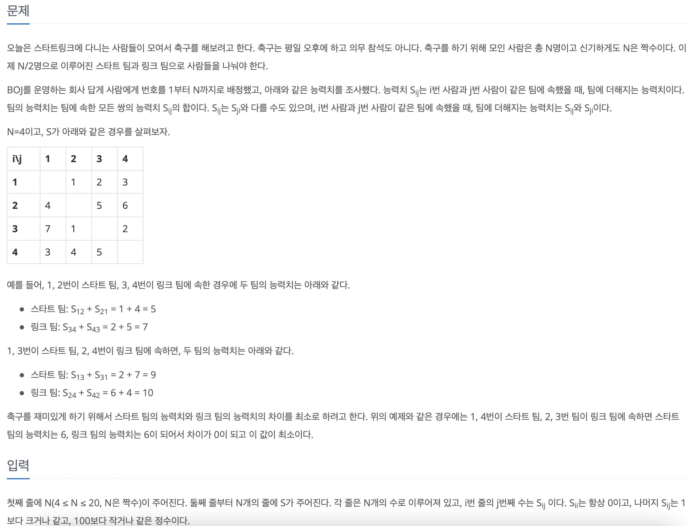

<br>

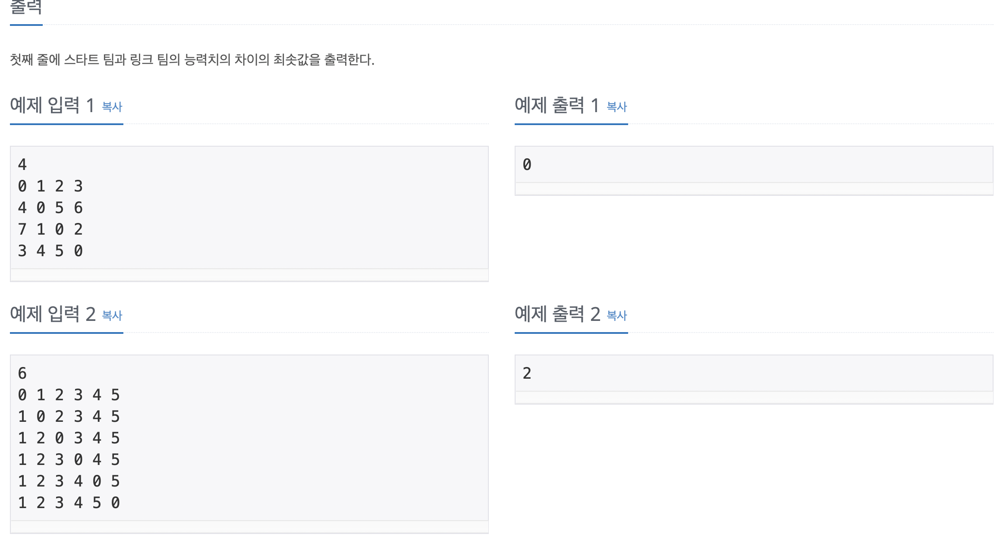

<br>

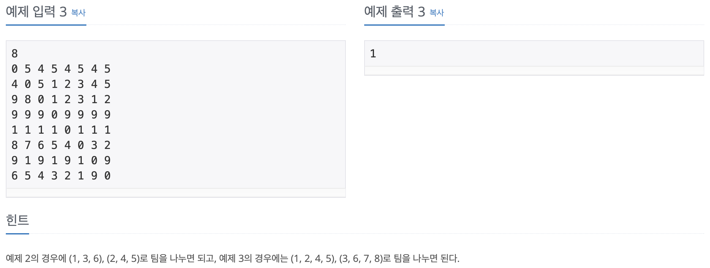

<br>

```Java
import java.util.*;
import java.io.*;

public class Main {

    static int N;
    static int[][] map;
    static boolean[] visit;

    static int Min = Integer.MAX_VALUE;

    public static void main(String[] args) throws IOException {

        BufferedReader br = new BufferedReader(new InputStreamReader(System.in));
        N = Integer.parseInt(br.readLine());
        map = new int[N][N];
        visit = new boolean[N];

        for (int i = 0; i < map.length; i++) {
            StringTokenizer st = new StringTokenizer(br.readLine());
            for (int j = 0; j < map[0].length; j++) {
                map[i][j] = Integer.parseInt(st.nextToken());
            }
        }

        combination(0, 0);

        System.out.println(Min);
    }

    static void combination(int index, int depth) {
        if (depth == N / 2) {
            diff();
            return;
        }

        for (int i = index; i < N; i++) {
            if (!visit[i]) {
                visit[i] = true;
                combination(i + 1, depth + 1);
                visit[i] = false;
            }
        }
    }

    static void diff() {
        int team_start = 0;
        int team_link = 0;

        for (int i = 0; i < N - 1; i++) {
            for (int j = i + 1; j < N; j++) {
                if (visit[i] == true && visit[j] == true) {
                    team_start += map[i][j];
                    team_start += map[j][i];
                } else if (visit[i] == false && visit[j] == false) {
                    team_link += map[i][j];
                    team_link += map[j][i];
                }
            }
        }
        
        int val = Math.abs(team_start - team_link);

        if (val == 0) {
            System.out.println(val);
            System.exit(0);
        }

        Min = Math.min(val, Min);
    }
}
```

---

<br>

## 부등호(No.2529)

<br>

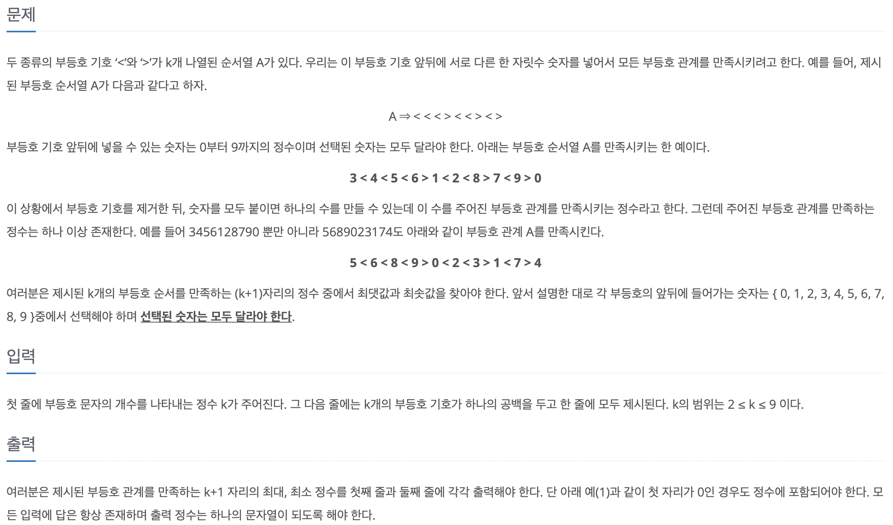

<br>

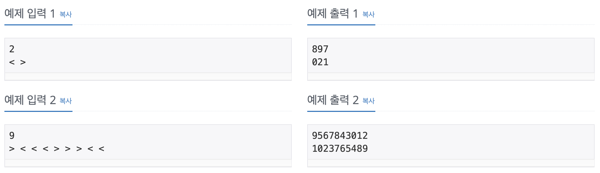

<br>

---

<br>

## 다음 순열(No.10972)

<br>

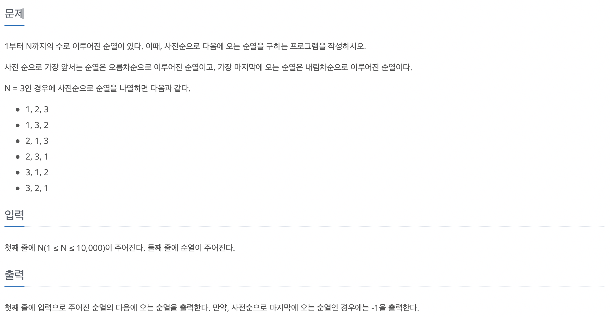

<br>

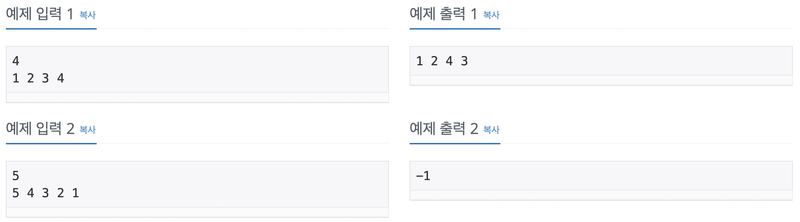

<br>

### 알고리즘   

<br>

```Java
import java.util.*;
import java.io.*;

public class Main {

    static int N;
    static int[] permutation;
    static StringBuilder sb = new StringBuilder();

    public static void main(String[] args) throws IOException {

        BufferedReader br = new BufferedReader(new InputStreamReader(System.in));
        N = Integer.parseInt(br.readLine());
        permutation = new int[N];

        StringTokenizer st = new StringTokenizer(br.readLine());

        for (int i = 0; i < permutation.length; i++) {
            permutation[i] = Integer.parseInt(st.nextToken());
        }

        if (nextPermutation()) {
            for (int i : permutation) {
                sb.append(i).append(' ');
            }
        } else {
            sb.append(-1);
        }

        System.out.println(sb);
    }

    static boolean nextPermutation() {

        int index01 = permutation.length - 1;
        while (index01 > 0 && permutation[index01] <= permutation[index01 - 1]) index01--;

        if (index01 <= 0) return false;

        int index02 = permutation.length - 1;
        while (permutation[index02] <= permutation[index01 - 1]) index02--;

        swap(index01 - 1, index02);

        index02 = permutation.length - 1;

        while (index01 < index02) {
            swap(index01, index02);
            index01++;
            index02--;
        }

        return true;
    }

    static void swap(int index01, int index02) {
        int temp = permutation[index01];
        permutation[index01] = permutation[index02];
        permutaion[index02] = temp;
    }
}
```


